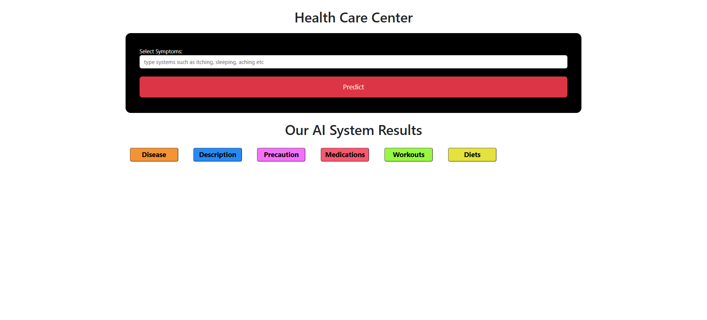

# 🩺 Medical Recommendation System

A web-based intelligent diagnosis and lifestyle recommendation platform powered by machine learning. This system predicts possible diseases based on symptoms and provides detailed recommendations for medication, diet, workout, and precautions.

---

## 🌟 Key Features

✅ **Disease Prediction** using a pre-trained Support Vector Classifier (SVC)  
✅ **Health Recommendation System**:
- 🧾 Disease Description
- 💊 Medication suggestions
- 🥗 Diet plans
- 🧘‍♂️ Workout tips
- 🛡️ Precautionary measures

✅ **Interactive Web Interface** using Flask  
✅ **End-to-End ML Integration**: Model trained, serialized, and served  
✅ **Data-driven**: Uses curated `.csv` datasets for recommendation

---

## 🖼️ Demo Screenshot



---

## 🗂️ Dataset Files Used

- `datasets/precautions_df.csv`: Disease-wise precautions
- `datasets/workout_df.csv`: Recommended workouts
- `datasets/description.csv`: Disease descriptions
- `datasets/medications.csv`: Suggested medicines
- `datasets/diets.csv`: Suggested diets

---

## 🧠 How It Works

1. **User Input**: Enter symptoms through the web form.
2. **Prediction**: SVC model predicts the most likely disease.
3. **Recommendation Engine** (in `app.py`) fetches:
   - Description from `description.csv`
   - Precautions from `precautions_df.csv`
   - Medications from `medications.csv`
   - Diets from `diets.csv`
   - Workouts from `workout_df.csv`
4. **Output**: All results are rendered via `index.html`.

---

## ⚙️ Installation & Setup

### 1. Clone the Repository

```bash
   git clone https://github.com/yourusername/Medical-Recommendation-System.git
   cd Medical-Recommendation-System
```
### 2. Create Virtual Environment
```bash
   python -m venv venv
   source venv/bin/activate  # Windows: venv\Scripts\activate
```
### 3. Install Dependencies
```bash
    pip install -r requirements.txt
```
#### Dependencies:
- pandas
- scikit-learn
- numpy
- pickle
- flask

---
## ▶️ Run the Web App
```bash
  python app.py
```
Visit `http://127.0.0.1:5000/` in your browser.

---
## 📁 Project Structure
``` plaintext
Medical-Recommendation-System/
├── app.py                     # Flask backend with ML logic
├── main.ipynb                 # Jupyter Notebook: model training
├── models/
│   └── svc.pkl                # Trained SVC model
├── datasets/                 # Data files for recommendation
│   ├── description.csv
│   ├── precautions_df.csv
│   ├── medications.csv
│   ├── diets.csv
│   └── workout_df.csv
├── templates/
│   └── index.html             # Frontend template
├── static/
│   └── img.png                # Screenshot or banner
├── requirements.txt           # Dependencies
├── .gitignore
├── LICENSE
└── README.md
```

---
## 🧪 Model Training
The main.ipynb notebook performs:
- Data loading and preprocessing
- Model training using Scikit-learn's SVC
- Model evaluation (accuracy, confusion matrix)
- Model serialization (svc.pkl)
---
## 🔍 Sample Output
__Predicted Disease:__ Diabetes<br>
__Recommendations:__
- 🧾 Description: Chronic condition that affects the way the body processes blood sugar.
- 💊 Medication: Insulin, Metformin
- 🥗 Diet: Low-sugar foods, leafy vegetables
- 🧘 Workout: Light cardio, daily walk
- 🛡️ Precautions: Regular sugar check, avoid sugary foods
---
## 🙋‍♂️ Maintainer
Debasish Paul<br>
📧 [Email](www.debasish999@gmail.com)
🔗 [LinkedIn](https://www.linkedin.com/in/debasishpaul999/)
📁 [Github_Repository](https://github.com/debasishpaul999/Medical-Recomendation-System.git)